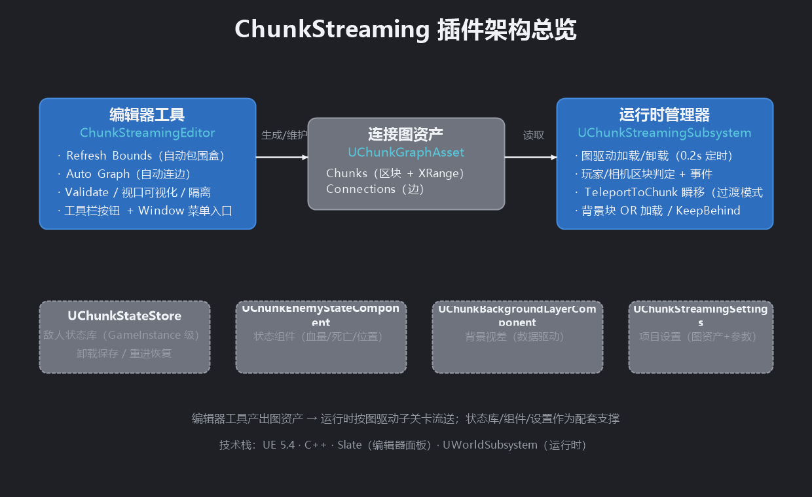
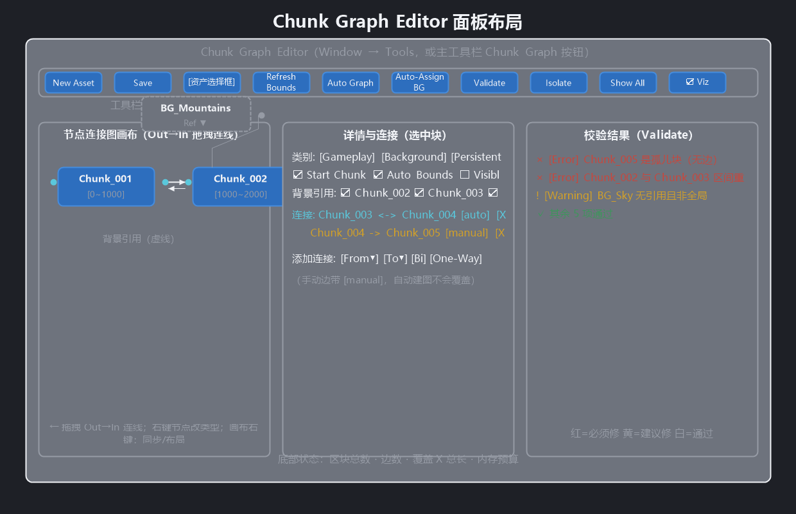
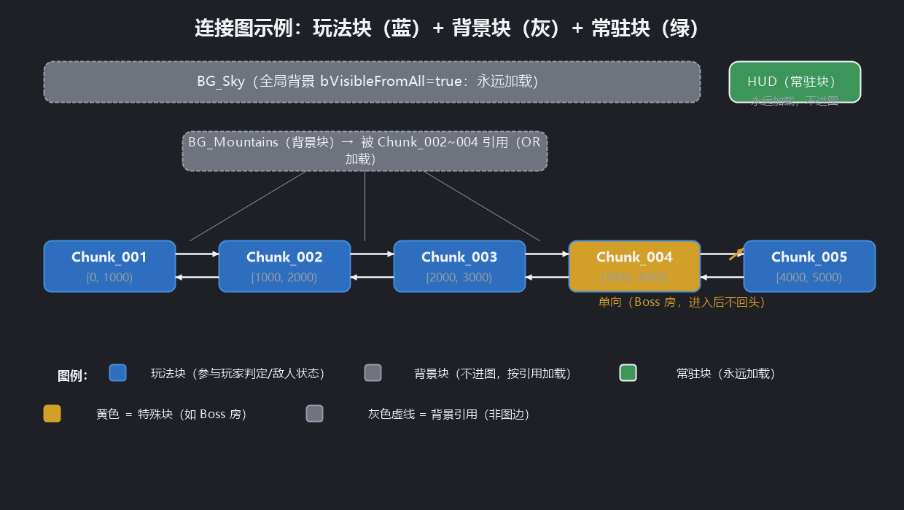
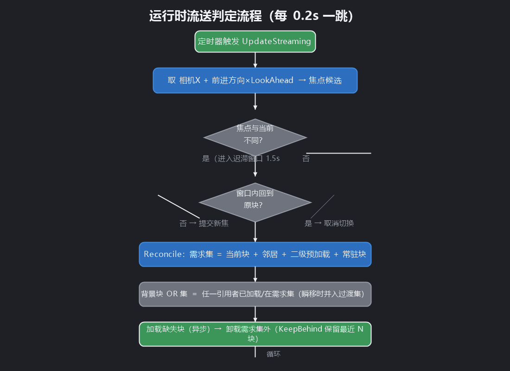
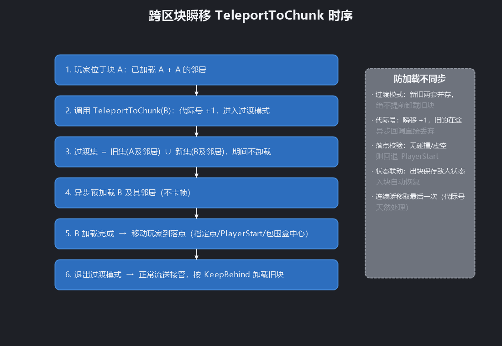
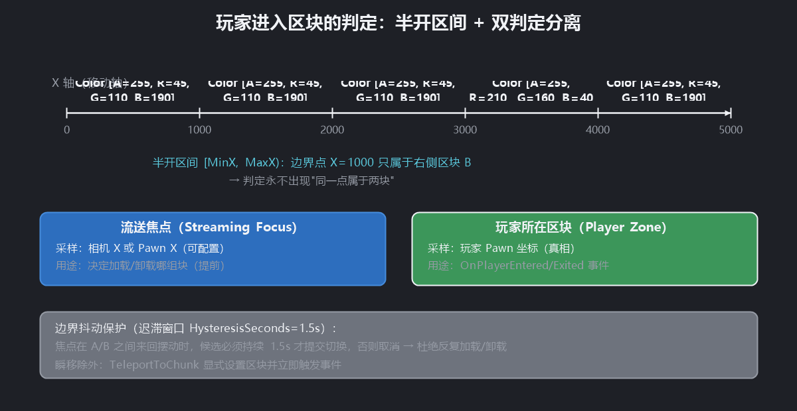

# Chunk Streaming 插件使用说明

> 版本：1.0.0（UE 5.4）
> 位置：`Plugins/ChunkStreaming`
> 功能：图驱动的关卡流送 —— 子关卡分块、按连接图动态加载/卸载、跨区块瞬移、敌人状态持久化、背景装饰块。

---

## 1. 插件能做什么

面向横板 3D 超长连续世界的关卡流送方案：

| 能力 | 说明 |
|---|---|
| **图驱动流送** | 关卡 = 若干子关卡（区块），区块之间用"连接图"表示可达关系；运行时永远只加载"当前区块 + 邻居" |
| **自动判断** | 区块包围盒、连接关系、背景引用全部由编辑器工具自动计算，无需手动填写 |
| **玩家进入判定** | 自动检测玩家所在区块并广播事件（基于玩家坐标，与流送判断分离） |
| **跨区块瞬移** | `Teleport To Chunk` 节点：先预加载目标区块再传送，过渡期间不卸载旧区块 |
| **敌人状态持久化** | 区块卸载时自动保存敌人状态（血量/死亡/位置），重新进入按状态恢复 |
| **背景装饰块** | 无逻辑的背景块可被多个玩法块共享（OR 加载），支持视差滚动 |



---

## 2. 快速开始（5 步）

### 第 1 步：把超长关卡拆成子关卡

1. 打开你的主关卡（持久关卡 Persistent Level）
2. `Window → Levels` 打开关卡面板
3. 把长关卡的内容按 X 轴切成若干段，每段创建一个**子关卡**（建议命名 `Chunk_001`、`Chunk_002`…，背景块用 `BG_` 前缀）
4. 切块边界放在**视觉干净的位置**（门、隧道、黑场），避免接缝穿帮

> 提示：区块之间不需要"物理上挨着"——连接关系由工具自动判断，间隙小于容差就算相邻；也可以手动连接传送边。

### 第 2 步：打开连接图编辑器

两种打开方式（任选其一）：

- **主工具栏按钮**：编辑器顶部工具栏（Play 按钮旁边）点 **Chunk Graph**
- **菜单**：顶部菜单 `Window → Tools → Chunk Graph Editor`

然后点击面板里的 **New Asset**（自动在 `/Game/ChunkStreaming/` 创建 `ChunkGraph_Main`）。面板布局见下图（左栏为节点连接图画布）：



### 第 3 步：一键生成图

1. 点 **Refresh Bounds** —— 扫描所有子关卡，自动计算包围盒和 XRange
2. 点 **Auto Graph** —— 自动连接相邻区块（自动边，可手动增删）
3. 点 **Auto-Assign BG** —— 背景块自动分配"被哪些玩法块看到"
4. 点 **Validate** 检查错误，全绿后点 **Save**

### 第 4 步：在项目设置里指定图资产

`Edit → Project Settings → Chunk Streaming`：

- **Graph Asset**：选择刚才创建的 `ChunkGraph_Main`
- 其余参数保持默认即可（可调，见第 5 节）

### 第 5 步：试玩

点 **Play**（PIE）。移动相机/玩家：

- 前方区块自动预加载，身后区块自动卸载（身后保留 1 块可回头）
- 控制台输入 `ChunkStream.Debug 1` 可看到区块线框与 HUD 信息
- 蓝图里绑定 `On Player Entered Chunk` 事件做区域玩法

---

## 3. 编辑器工具（Chunk Graph Editor 面板）

打开方式：主工具栏 **Chunk Graph** 按钮，或 `Window → Tools → Chunk Graph Editor`

### 工具栏按钮

| 按钮 | 功能 |
|---|---|
| **New Asset** | 在 `/Game/ChunkStreaming` 创建新的图资产 |
| **Save** | 保存当前图资产 |
| **资产选择框** | 切换要编辑的图资产 |
| **Refresh Bounds** | 重新扫描子关卡，刷新所有区块的包围盒/XRange；**范围优先按"可碰撞物体"计算**（更贴合可玩区域），无碰撞物体的块（如纯背景块）退化为全量范围（尊重每块的 `bAutoBounds` 开关） |
| **Auto Graph** | 重新生成自动边（删除不再相邻的自动边、补充新相邻的），**手动边永远保留** |
| **Auto-Assign BG** | 把每个背景块自动分配给"XRange 与之相交的所有玩法块" |
| **Validate** | 校验：孤儿块、区间重叠、重复连接、断连组件、无效包围盒、背景块无引用等 |
| **Isolate Chunk** | 编辑器视口只显示选中块 + 它的邻居（方便编辑） |
| **Show All** | 恢复所有子关卡可见 |
| **Viewport Viz** | 在视口绘制区块包围盒与连接线（开启后自动跟随选中块高亮） |

### 左栏：节点连接图画布（推荐用法）

面板左侧是**节点连接图**（动画状态机风格），一个节点 = 一个区块：

- **无向连接**：连接**不区分方向/进/出，只存在"相连/不相连"**。**按住区块任意位置拖到另一个区块，松手即建立连接**（动画状态机式）：拖动时鼠标进入目标区块会出现**绿色预览线**（从源节点边缘跟随鼠标）、目标区块变绿高亮，松手连接；连接线自动取两个节点边缘之间的**最短路径**
- **智能区分**：**拖到区块上 = 连接**；**拖到空白处 = 移动节点**（拖动中节点跟随鼠标，松手落位）；**原地点击 = 选中节点**——三种操作无需精确瞄准
- **断开**：**Ctrl+点击**区块 = 断开该区块所有连接；或右键节点 → 删除该块所有连接
- **背景引用**：按住背景块拖到玩法块 = "该玩法块加载时背景块也加载"（OR 引用，浅色细线）
- **节点颜色**：蓝 = 玩法块、灰 = 背景块、绿 = 常驻块、黄 = 出生块
- **右键节点**：设为出生块 / 设为玩法块 / 背景块 / 常驻块 / 全局背景 / 删除该块所有连接
- **右键画布空白处**：从资产同步节点 / 自动布局 / 同步图到资产
- **自动同步**：拖线、删线、改类型都会**立即写回图资产**（`bAutoGenerated` 标记自动保留）；删除节点会被自动恢复（区块由资产管理）
- 节点位置随资产保存，重启编辑器不丢失；点选中节点，右侧显示详情

> 中间栏的"连接列表 / Add connection"仍可手动添加边（在节点图上拖圆点更直观）。
> **旧资产自动升级**：旧版单向边会全部视为双向（无向语义），无需重新连接；重新点一次 Save 即可。

### 中间栏：详情与连接

- **Category**：Gameplay（玩法）/ Background（背景装饰）/ Persistent（常驻）
- **Start Chunk（出生块）**：运行时初始加载该块
- **Visible From All（全局背景）**：背景块永远可见（天空、最远山）
- **Auto Bounds**：是否允许工具自动刷新该块包围盒
- **背景块的 Visible From Chunks**：勾选哪些玩法块"看得到"它
- **连接列表**：每条边显示 `A — B`（无向）、来源（auto/manual），可删除
- **Add connection**：选 Chunk A / Chunk B 后点 **Connect** 添加手动边

### 右栏：校验结果

红色 = Error（必须修），黄色 = Warning（建议修），白色 = 通过。

---

## 4. 区块类型

| 类型 | 参与连接图 | 玩家进入判定 | 敌人状态 | 加载规则 |
|---|---|---|---|---|
| **Gameplay** | ✅ | ✅ | ✅ | 图驱动：当前块 + 邻居 + 预加载 |
| **Background** | ❌ | ❌ | ❌ | OR 加载：任一引用它的玩法块加载则加载 |
| **Persistent** | ❌ | ❌ | ❌ | 永远加载（HUD、全局系统） |

- 背景块自动识别：包名含 `BG_` 或 `BKG` 的会被建议为 Background
- 背景块**不会**出现在连接图里（避免和邻接边混淆），它的"关系"是 Visible From Chunks 引用
- **隔离区块规则**：允许区块**不与任何区块相连**——这类区块**只能通过传送进入**（`Teleport To Chunk` / `Preload Teleport To Location`），玩家离开后会被卸载。适合隐藏房间、Boss 房、独立副本区域
- **连通分量隔离**：一组相连的区块与另一组不相连的区块，**永远不会被同时加载**。流送焦点只能沿连接展开（预加载点落在别的区块组内会被忽略，直到玩家真正进入）；卸载保留（KeepBehind）也只作用于当前分组。跨分组只能通过传送
- **重叠判定规则**：判定优先用 **3D 包围盒包含**（坐标真的落在哪个块的包围盒内），多个块都包含时取**范围最小**的块；3D 未命中才回退纯移动轴判定。移动轴在**图资产属性 → Movement Axis** 里设置（沿 Y 的横板游戏选 **Y**）；沿移动轴的投影重叠属正常布局，**不再产生任何警告**
- **X 轴重叠不再警告**：横板游戏沿移动轴（默认 X，可设 Y）布局时，另一轴的投影重叠是正常的（不同横排/不同 Z 的房间），校验只对**真正的 3D 包围盒相交**报错

三种区块在连接图中的关系示意：



---

## 5. 运行时参数（Project Settings → Chunk Streaming）

| 参数 | 默认 | 说明 |
|---|---|---|
| `bEnableStreaming` | true | 总开关 |
| `UpdateInterval` | 0.2s | 流送判定周期（不需要每帧） |
| `LookAheadDistance` | 2500 | 沿移动方向在参考点之外提前加载的距离（建议 ≥ 半屏宽 + 缓冲） |
| `bUsePawnAsStreamingSource` | false | **流送参考点**：true = 以玩家 Pawn 为中心；false = 以摄像机为中心（默认） |
| `HysteresisSeconds` | 1.5 | 迟滞窗口：边界来回抖动时不切换区块 |
| `KeepBehindCount` | 1 | 身后保留的区块数（仅对"可步行回头"的块生效；隔离区块/远距块一律卸载） |
| `KeepBehindDistance` | 5000 | 保留距离：距参考点超过该距离的未需求区块直接卸载（远距传送离开的块不留） |
| `bPreloadNextHop` | true | 二级预加载：沿前进方向再预加载下一跳 |
| `bDebugDraw` | false | 默认开启调试可视化 |

运行时判定流程：



---

## 6. 蓝图 API

### 查询（Get Chunk Streaming Subsystem → 节点）

| 节点 | 返回 |
|---|---|
| `Get Player Chunk` | 玩家当前所在区块（玩家坐标） |
| `Get Streaming Chunk` | 当前流送焦点区块（参考点 + 预加载；参考点默认相机，勾选 Pawn 选项后为玩家位置） |
| `Is Chunk Loaded` | 区块是否已加载 |
| `Get Graph Asset` | 图资产引用（可再查 Find Chunk At X 等） |

### 事件（在蓝图上绑定）

| 事件 | 触发时机 |
|---|---|
| `On Player Entered Chunk (ChunkName, PreviousChunk)` | 玩家进入新区块（含瞬移） |
| `On Player Exited Chunk (ChunkName, PreviousChunk)` | 玩家离开区块 |
| `On Chunk Load Started (ChunkName)` | 区块开始异步加载 |
| `On Chunk Load Finished (ChunkName)` | 区块加载完成（敌人状态已恢复） |

### 瞬移节点

```
Teleport To Chunk (TargetChunk, TargetLocation)
```

- 异步预加载目标块及其邻居 → 加载完成后移动玩家（过渡期间**不会**卸载旧区块）
- `TargetLocation` 传 (0,0,0) 时自动使用目标块的 PlayerStart，否则用区块包围盒中心
- 瞬移会自动广播进入/离开事件、保存旧块敌人状态、恢复目标块敌人状态
- 带"代际号"机制：瞬移后旧的在途加载回调会被丢弃，不会出现加载不同步



### 预加载传送节点（推荐：防开局掉落）

`Preload Teleport To Location` —— **延迟节点（类似 Delay）**，在蓝图右键搜索即可找到（静态节点，Chunk Streaming 分类）。和 SetActorLocation 一样传坐标，但会**先加载坐标所在区块再传送**：

```
输入：World Context | Target Actor（留空=玩家 Pawn）| Target Location | Timeout Seconds
输出：单个执行输出 —— 区块加载完成、角色传送到位后触发（像 Delay 一样等待后继续）
```

- 目标区块**已加载** → 立即传送并立即完成（无等待）
- 目标区块**加载中/未加载** → 角色保持不动，区块（含邻居）加载完成后传送 + 触发输出
- **超时**（默认 10s，可传参）→ 强制传送 + 警告日志，仍会完成
- 实现原理：等待期间目标块及其邻居加入需求集（不会被卸载），完成后自动释放
- 同类的 `Teleport To Chunk`（按区块名传送）也已改为静态节点，可在搜索里直接找到

**解决"开局掉下去"的标准用法**（存档传送处）：

```
读取存档 → 得到保存坐标
  → 调用 Preload Teleport To Location（等待时角色保持原地；可先禁用输入/显示 Loading）
  → 输出分支：启用输入 / 淡入画面
```

> 注意：加载完成前角色保持原地（可能还在半空/出生点），建议等待期间暂停角色移动与重力，输出触发后再恢复。

### 敌人状态（蓝图侧）

**挂 `ChunkEnemyStateComponent` 即可自动保存（推荐，无需实现接口）**：

- 组件挂在敌人 Actor 上；卸载区块时自动保存、重载时自动恢复
- 自动保存的固定字段：`Health`（血量）、`bDead`（死亡标记，死亡敌人不复活）、`SavedTransform`（位置）
- **反射自动收集（v2）**：敌人的**数值型变量**（float/double/int/bool/枚举/字符串/名字 + FVector/FRotator/FQuat/FTransform/FLinearColor/FColor/FVector2D/FIntPoint）**自动打包保存**；对象引用、数组、Map、委托等自动跳过
- **组件 Tag 白名单**：组件属性里设置 `ComponentTagsToSave`（如 `SaveState`），敌人身上挂有这些 **Tag** 的组件，其数值型变量也会被自动保存（默认空 = 只保存 Actor 自身）
- 变量需为 UPROPERTY（蓝图变量默认就是）；`Transient`/`BlueprintReadOnly` 变量不参与保存
- 自定义扩展：重写接口的 `SaveChunkState`/`RestoreChunkState`（蓝图实现 ChunkSaveable 接口）可补充自定义数据到 `CustomData`

**组件发现（v2）**：保存/恢复遍历会同时检查 Actor 自身接口与挂载组件上的接口——实现 `ChunkSaveable` 接口的组件（如 ChunkEnemyStateComponent）会被自动发现，**挂组件即可，无需在敌人蓝图上实现接口**。

- 给敌人挂 **ChunkEnemyStateComponent** 即可自动保存：血量、死亡、位置
- 特殊敌人可在蓝图里实现 **Chunk Saveable** 接口（Save Chunk State / Restore Chunk State / Get Enemy Id），写自定义状态
- 状态存在 **ChunkStateStore**（GameInstance 级），可调用 `Get All States` / `Set All States` 并入你的存档系统（如 EasyMultiSave）

### 背景视差

背景块内挂 **ChunkBackgroundLayerComponent**：

- `ParallaxFactor`：0 = 完全跟随相机，1 = 完全静止
- `ZOffset`：垂直抬升
- `bFollowCameraZ`：Z 轴是否跟随

---

## 7. 调试

| 命令 | 说明 |
|---|---|
| `ChunkStream.Debug 1` / `0` | 开/关调试可视化（HUD + 区块边界） |
| `ChunkStream.Debug` | 切换开关 |

开启后（PIE 里按 `~` 输入命令）：

- **区块边界**：蓝色**线框** = 玩法块未加载；蓝色**实心** = 玩法块已加载；灰色 = 背景块；绿色 = 常驻块；**黄色** = 当前流送焦点块；**红色** = 玩家所在块
- **连接线**：青色线条 = 当前焦点块到邻居的连接
- **参考点标记**：青色球 = 相机参考点；绿色球 = Pawn 参考点（勾选 `bUsePawnAsStreamingSource` 时）；**品红色线** = 预加载方向（参考点 → LookAhead 目标）
- **HUD**：显示 `PlayerChunk`、`StreamingChunk`、已加载数、加载中数、背景块数；配置异常时附加提示（如"主关卡没有流送子关卡！请在 Levels 面板添加"、"参考点不在任何区块范围内"）

编辑器里勾选 Graph Editor 面板的 **Viewport Viz**，可在关卡编辑器视口显示同样的边界与连接（编辑期调试用）。

每次 PIE 启动时日志会输出诊断：图资产名、流送子关卡数、图区块数；配置缺失会输出明确中文警告（"未配置图资产" / "当前主关卡没有流送子关卡"）。

---

## 8. 常见问题

**Q: 玩家走到区块边界时画面卡顿？**
加大 `LookAheadDistance`；确认切块边界在视觉不可见处；区块内容不要太大。

**Q: 边界来回走动时区块反复加载/卸载？**
这是迟滞窗口要解决的——确认 `HysteresisSeconds` > 0；如果仍抖动，检查两个区块的 XRange 是否有重叠（Validate 会报错）。边界归属与双判定机制见下图：



**Q: 敌人重进区块后满血复活？**
检查敌人是否挂了 `ChunkEnemyStateComponent`（或实现了 Chunk Saveable 接口）；确认敌人血量修改的是组件上的 `Health` 字段（或自己实现接口同步）。

**Q: 想让已死亡的敌人重新出现？**
调用 `ChunkStateStore → Clear Chunk State (区块名)` 后重新进入该区块。

**Q: 背景块没显示？**
检查：区块类型是否为 Background；是否有玩法块引用它（或勾选 Visible From All）；Validate 是否报"never referenced"。

**Q: 瞬移后掉到虚空？**
确认目标块里放了 PlayerStart；或给 `Teleport To Chunk` 传一个有效落点。

**Q: 图资产改了但 PIE 里没生效？**
图资产在运行时按引用加载，PIE 前先 Save 资产；PIE 中修改请重启 PIE。

**Q: 打开游戏不加载区块？**
先按 `~` 看控制台或用 `ChunkStream.Debug 1` 看 HUD/日志：
- 提示"不是当前世界的流送子关卡" → 分块关卡还没挂到主关卡：打开主关卡 → `Window → Levels` → **Add** 选择分块关卡添加为流送子关卡 → 保存 → 再到 Chunk Graph 面板 **Refresh Bounds → Auto Graph → Save** 同步图资产
- 提示"参考点不在任何区块范围内" → 检查 PlayerStart 位置是否落在某个区块的 XRange 内
- 提示"未配置图资产" → `Edit → Project Settings → Chunk Streaming` 里指定 Graph Asset

**Q: 日志警告"子关卡被设为 Always Loaded"或区块卸载后马上又回来？**
子关卡的流送方式被设成了 **Always Loaded**（引擎会强制加载且**永远拒绝卸载**，卸载请求会永久卡住）。修复：`Window → World Browser`（世界浏览器）→ 选中该子关卡 → 右键 → **Change Streaming Method → Blueprint** → 保存主关卡。若想在开局不预加载，再在 World Browser 里把该子关卡设为 Unloaded 后保存。

**Q: 日志出现"卸载超时，已恢复状态"？**
同上：几乎都是子关卡被设成了 Always Loaded，或该块内有仍被引用的 Actor 阻止卸载。按上一条处理（管理器会在 15 秒后自动恢复记账，不会永久卡死）。

**Q: 隔离区块（传送专用房间）会被预加载吗？**
不会。隔离区块只能通过 `Teleport To Chunk` / `Preload Teleport To Location` 进入；即使预加载判定点（参考点 + LookAhead）落在其范围内，也不会抢占流送焦点（仅当玩家真正在其内部时才成为焦点），避免"玩家不在的地方反而加载了"。

**Q: 用 Open Level 重新进入关卡后，所有子关卡一起加载、不再卸载？**
已修复（v2）：每次进入关卡时，流送系统会"对账"认领引擎侧已加载/正在加载的子关卡（Open Level 后引擎异步加载完成的事件也会被纳入管理并正确卸载）。若仍异常，检查日志是否有"跟随引擎加载中的区块"/"认领引擎加载的区块"；同时确认子关卡流送方式为 Blueprint（见上文 Always Loaded 条目）。

**Q: 找不到 Chunk Graph 面板？**

确认已**完全关闭并重新打开编辑器**（插件 DLL 在启动时加载）；然后点主工具栏 **Chunk Graph** 按钮，或 `Window → Tools → Chunk Graph Editor`。仍找不到就检查 `Saved/Logs/ProjectRainWalker.log` 里是否有 `[ChunkStreaming] Editor module loaded`。

---

## 9. 实现机制备忘（给开发者）

- **半开区间** `[MinX, MaxX)`：边界点只属于右侧区块，杜绝"同时属于两块"
- **双判定分离**：流送焦点跟参考点（默认相机，可配置为 Pawn，+LookAhead），玩家事件跟玩家坐标，互不干扰
- **OR 加载**：背景块只要有一个引用者在需求集/已加载集就保持加载，跨块无缝
- **KeepBehind**：未需求区块按"距参考点最近优先保留 N 个"，其余卸载
- **代际号**：瞬移 +1，旧代际异步回调直接丢弃
- **过渡模式**：瞬移期间 DesiredSet = 旧集 ∪ 新集，绝不提前卸载
- **Latent 加载**：`LoadStreamLevel`/`UnloadStreamLevel` 均异步，完成回调按 `IsLevelLoaded` 对账
- **隔离区块**：无连接的玩法块 = 传送专用区；进入后按"当前块"加载，离开后一律卸载（KeepBehind 仅对可步行回头的块生效）
- **碰撞范围**：区块 XRange 优先由可碰撞组件（碰撞开启的 PrimitiveComponent）包围盒并集生成，无碰撞时退化为全 Actor 范围
- **自动连边空间约束**：相邻判定除 X 区间外还要求 Y/Z 中心距离在容差内（不同 Y/Z 的房间不会被自动连接）
- **重叠判定**：3D 包围盒包含优先，多个包含时取范围最小；X 投影重叠但空间分离（不同 Y/Z 房间）不视为问题（校验仅 Info）

---

*配图说明：本文档配图为示意图（非编辑器真实截图），用于说明架构、布局与机制；实际界面以编辑器内为准。*
